I-213 descriptive analysis
================
[Phil Neff](https://github.com/philneff)
22 September, 2021

``` r
pacman::p_load(tidyverse, lubridate, here, skimr, yaml, ggplot2, ggalt, gplots,
               sf, rnaturalearth, rnaturalearthdata, maps, tools, RColorBrewer
               )

inputfile <- here::here("write/input/uw-chr-i213-public.csv.gz")

i213 <- read_delim(
    inputfile, delim = "|", 
    col_types = cols(
        .default                     = col_character(),
        source                       = col_factor(),
        sex                          = col_factor(),
        cmplxn                       = col_character(),
        country_of_citizenship       = col_factor(),
        year                         = col_double(),
        month                        = col_double(),
        day                          = col_double(),
        hour                         = col_double(),
        minute                       = col_double(),
        fy                           = col_double(),
        age                          = col_double(),
        accompanied_juvenile_flag    = col_double(),
        unaccompanied_juvenile_flag  = col_double(),
        custody_redetermination_flag = col_double()
))
```

# Descriptive analysis of UWCHR I-213 collection

As part of its [“Human Rights At
Home”](https://jsis.washington.edu/humanrights/projects/human-rights-at-home/)
and [“Immigrant Rights
Observatory”](https://jsis.washington.edu/humanrights/projects/human-rights-at-home/immigrant-rights-observatory/)
research initiatives, the University of Washington Center for Human
Rights (UWCHR) has obtained a collection of I-213 “Record of
Deportable/Inadmissible Alien” forms via Freedom of Information Act
(FOIA) requests to the US Department of Homeland Security (DHS). These
internal forms documenting apprehensions by US Immigration and Customs
Enforcement (ICE) and Customs and Border Protection (CBP) are an
important source of qualitative and quantitative information regarding
immigration enforcement practices and patterns.

Under FOIA, UWCHR initially requested all I-213s produced by both CBP
and ICE in the state of Washington from 2012-2017; when the agencies
failed to adhere to the requirements of FOIA—first claiming privacy
waivers were needed for every individual form and then claiming that as
law enforcement agencies, they were exempt from providing such
records—UWCHR sued in September 2018. UWCHR underwent separate
settlement negotiations with each sub-agency. In these discussions, CBP
agreed to provide a sample of all documents produced by staff in the
agency’s Blaine and Spokane sectors from January 1, 2012 to September
30, 2017; and ICE agreed to provide copies of all documents produced
from January 1, 2019 to March 31, 2020 by staff from the agency’s
Seattle field office.

The resulting PDF forms were scraped and cleaned in a separate private
repository developed by the Human Rights Data Analysis Group (HRDAG) and
maintained by UWCHR. Cleaning and hand-coding of resulting data is
ongoing; the following is a preliminary descriptive analysis of the
collection. Maps of apprehension locations by I-213 `at_near` value and
`at_near` county per capita were previously published for UWCHR’s August
2021 report [“Protecting Immigrant Rights: Is Washington’s Law
Working?”](https://jsis.washington.edu/humanrights/2021/08/11/protecting-immigrant-rights-is-washingtons-law-working/).

  - Link to map-wa.Rmd

## I-213 structure

Each record is made up of an I-213 “Record of Deportable/Inadmissible
Alien” form collecting subject identification, biometrics, and
apprehension characteristics data in a structured format (typographical
variations may be introduced in the scraping process, we have attempted
to standardize values in the cleaning process); followed by a
semi-structured “Narrative” field containing additional description of
the subject and apprehension, usually continued from the I-213 on one or
more I-831 “Continuation Page” forms. Personally identifying information
such as names and unique identifiers are redacted; narratives also
include redactions under various FOIA exemptions. A small number of
forms are fully redacted.

“Narrative” field contents are excluded from the public version of this
dataset because they may contain sensitive information. Dataset fields
following the naming convention `mentions_*` reflect simple
`str_detect()` results for keywords in the “Narrative” text as described
in the repository
[README](https://github.com/UWCHR/i-213-analysis#readme).

While I-213 form contents are relatively structured, some fields may be
left blank and the logic or meaning of codes used in some fields is
obscure. For more details, see this ICE [“I-213
Preparation”](http://hoppocklawfirm.com/wp-content/uploads/2019/03/How-to-Prepare-an-I-213.pdf)
document released via FOIA; note that in some cases field contents
differ from those described here.

### Sample I-213 form


### Sample I-831 form


## Data overview

``` r
i213 %>% skimr::skim()
```

|                                                  |            |
| :----------------------------------------------- | :--------- |
| Name                                             | Piped data |
| Number of rows                                   | 4054       |
| Number of columns                                | 62         |
| \_\_\_\_\_\_\_\_\_\_\_\_\_\_\_\_\_\_\_\_\_\_\_   |            |
| Column type frequency:                           |            |
| character                                        | 49         |
| factor                                           | 3          |
| numeric                                          | 10         |
| \_\_\_\_\_\_\_\_\_\_\_\_\_\_\_\_\_\_\_\_\_\_\_\_ |            |
| Group variables                                  | None       |

Data summary

**Variable type: character**

| skim\_variable                       | n\_missing | complete\_rate | min |  max | empty | n\_unique | whitespace |
| :----------------------------------- | ---------: | -------------: | --: | ---: | ----: | --------: | ---------: |
| file\_hash                           |          0 |           1.00 |  40 |   40 |     0 |      4054 |          0 |
| installment                          |          0 |           1.00 |   3 |   11 |     0 |        11 |          0 |
| at\_near                             |         79 |           0.98 |   1 |  111 |     0 |       273 |          0 |
| date\_of\_action                     |        446 |           0.89 |   2 |   27 |     0 |      1163 |          0 |
| location\_code                       |        604 |           0.85 |   3 |   15 |     0 |        66 |          0 |
| cmplxn                               |       1118 |           0.72 |   1 |   12 |     0 |        16 |          0 |
| us\_address\_zip                     |        627 |           0.85 |   3 |    7 |     0 |       548 |          0 |
| last\_entry                          |        665 |           0.84 |   1 |  105 |     0 |      2050 |          0 |
| method\_location\_apprehension       |        562 |           0.86 |   1 |   12 |     0 |        81 |          0 |
| foreign\_address                     |       3921 |           0.03 |  17 | 1862 |     0 |       131 |          0 |
| status\_at\_entry                    |       3765 |           0.07 |   1 |   26 |     0 |        58 |          0 |
| status\_when\_found                  |       3765 |           0.07 |   1 |   22 |     0 |        56 |          0 |
| mother\_nationality                  |       3363 |           0.17 |   4 |   30 |     0 |        62 |          0 |
| father\_nationality                  |       3901 |           0.04 |   4 |   19 |     0 |        27 |          0 |
| spouse\_nationality                  |       4016 |           0.01 |   4 |   13 |     0 |         8 |          0 |
| number\_nationality\_minor\_children |       1579 |           0.61 |   1 |   57 |     0 |       305 |          0 |
| disposition                          |        836 |           0.79 |   1 |   35 |     0 |        76 |          0 |
| charge\_code\_words                  |        235 |           0.94 |   1 |  368 |     0 |      2480 |          0 |
| date                                 |         39 |           0.99 |  10 |   10 |     0 |       633 |          0 |
| quarter                              |         39 |           0.99 |   6 |    6 |     0 |        35 |          0 |
| cota\_in\_force                      |         39 |           0.99 |   5 |    5 |     0 |         1 |          0 |
| kww\_in\_force                       |         39 |           0.99 |   4 |    5 |     0 |         2 |          0 |
| mentions\_airport                    |          0 |           1.00 |   4 |    5 |     0 |         2 |          0 |
| mentions\_anonymous\_tip             |          0 |           1.00 |   4 |    5 |     0 |         2 |          0 |
| mentions\_border\_patrol             |          0 |           1.00 |   4 |    5 |     0 |         2 |          0 |
| mentions\_bus                        |          0 |           1.00 |   4 |    5 |     0 |         2 |          0 |
| mentions\_corrections                |          0 |           1.00 |   4 |    5 |     0 |         2 |          0 |
| mentions\_courthouse                 |          0 |           1.00 |   4 |    5 |     0 |         2 |          0 |
| mentions\_database                   |          0 |           1.00 |   4 |    5 |     0 |         2 |          0 |
| mentions\_detainer                   |          0 |           1.00 |   4 |    5 |     0 |         2 |          0 |
| mentions\_family\_unit               |          0 |           1.00 |   4 |    5 |     0 |         2 |          0 |
| mentions\_greyhound                  |          0 |           1.00 |   4 |    5 |     0 |         2 |          0 |
| mentions\_hsi                        |          0 |           1.00 |   4 |    5 |     0 |         2 |          0 |
| mentions\_jail                       |          0 |           1.00 |   4 |    5 |     0 |         2 |          0 |
| mentions\_juvenile                   |          0 |           1.00 |   4 |    5 |     0 |         2 |          0 |
| mentions\_license\_plate             |          0 |           1.00 |   4 |    5 |     0 |         2 |          0 |
| mentions\_police                     |          0 |           1.00 |   4 |    5 |     0 |         2 |          0 |
| mentions\_prison                     |          0 |           1.00 |   4 |    5 |     0 |         2 |          0 |
| mentions\_probation\_office          |          0 |           1.00 |   4 |    5 |     0 |         2 |          0 |
| mentions\_secure\_comm               |          0 |           1.00 |   4 |    5 |     0 |         2 |          0 |
| mentions\_sheriff                    |          0 |           1.00 |   4 |    5 |     0 |         2 |          0 |
| mentions\_state\_patrol              |          0 |           1.00 |   4 |    5 |     0 |         2 |          0 |
| mentions\_surveillance               |          0 |           1.00 |   4 |    5 |     0 |         2 |          0 |
| mentions\_task\_force                |          0 |           1.00 |   4 |    5 |     0 |         2 |          0 |
| mentions\_traffic                    |          0 |           1.00 |   4 |    5 |     0 |         2 |          0 |
| state                                |        238 |           0.94 |   2 |    2 |     0 |        10 |          0 |
| county                               |        238 |           0.94 |   6 |   21 |     0 |        70 |          0 |
| lat                                  |        238 |           0.94 |   8 |   18 |     0 |       192 |          0 |
| lon                                  |        238 |           0.94 |   9 |   19 |     0 |       192 |          0 |

**Variable type: factor**

| skim\_variable           | n\_missing | complete\_rate | ordered | n\_unique | top\_counts                             |
| :----------------------- | ---------: | -------------: | :------ | --------: | :-------------------------------------- |
| source                   |          2 |           1.00 | FALSE   |         2 | ice: 3887, cbp: 165                     |
| sex                      |        710 |           0.82 | FALSE   |         3 | M: 2809, F: 530, U: 5                   |
| country\_of\_citizenship |          3 |           1.00 | FALSE   |       121 | MEX: 2525, IND: 274, GUA: 267, HON: 140 |

**Variable type: numeric**

| skim\_variable                 | n\_missing | complete\_rate |    mean |    sd |   p0 |  p25 |  p50 |  p75 | p100 | hist  |
| :----------------------------- | ---------: | -------------: | ------: | ----: | ---: | ---: | ---: | ---: | ---: | :---- |
| year                           |         34 |           0.99 | 2019.05 |  0.92 | 2008 | 2019 | 2019 | 2019 | 2020 | ▁▁▁▁▇ |
| month                          |         35 |           0.99 |    5.49 |  3.54 |    1 |    2 |    5 |    9 |   12 | ▇▂▃▂▃ |
| day                            |         35 |           0.99 |   15.92 |  8.71 |    1 |    8 |   16 |   24 |   31 | ▇▇▇▇▆ |
| hour                           |         84 |           0.98 |   11.60 |  5.43 |    0 |    9 |   11 |   15 |   23 | ▂▇▇▅▃ |
| minute                         |         84 |           0.98 |   27.00 | 17.87 |    0 |   12 |   30 |   43 |   59 | ▇▆▇▆▅ |
| age                            |        290 |           0.93 |   34.73 | 10.75 |    1 |   27 |   34 |   41 |   97 | ▁▇▃▁▁ |
| accompanied\_juvenile\_flag    |          2 |           1.00 |    0.00 |  0.03 |    0 |    0 |    0 |    0 |    1 | ▇▁▁▁▁ |
| unaccompanied\_juvenile\_flag  |          2 |           1.00 |    0.00 |  0.03 |    0 |    0 |    0 |    0 |    1 | ▇▁▁▁▁ |
| custody\_redetermination\_flag |          2 |           1.00 |    0.01 |  0.09 |    0 |    0 |    0 |    0 |    1 | ▇▁▁▁▁ |
| fy                             |         39 |           0.99 | 2019.24 |  0.96 | 2008 | 2019 | 2019 | 2020 | 2020 | ▁▁▁▁▇ |

## Record source

UWCHR’s I-213 collection consists of records produced by both CBP and
ICE via FOIA litigation, as described above. CBP records are a sample
(every 20th record) of all forms produced by staff in the agency’s
Blaine and Spokane sectors from January 1, 2012 to September 30, 2017;
ICE records include all documents produced from January 1, 2019 to March
31, 2020 by staff from the agency’s Seattle field office.

As seen below, some ICE records fall out of the window of time covered
by the FOIA settlement; closer scrutiny of these records often shows
that the I-213 “Date/Time” field (scraped as `year`, `month`, `day`,
`hour`, `minute` fields; also converted into fiscal year `fy`) sometimes
relates to a prior apprehension, with the `date_of_action` field more
accurately reflecting the date of the apprehension described by the
I-213 narrative. Missing “Date/Time” values have also been filled in
with `date_of_action` values where appropriate. This cleaning is ongoing
in a separate private repository; cleaning methods and data replacements
available for review upon request. For most analysis below we will
restrict the dataset to records dated January 1, 2019 and after.

A small number of records with missing `source` data represent
fully-redacted forms produced by ICE; these are excluded in the
following analysis. As CBP records are not intended to be comprehensive,
and because CBP apprehensions which result in individuals being
transferred to ICE custody are represented in the ICE I-213 collection,
CBP records are also excluded from the following analysis.

``` r
i213 <- i213 %>%
    filter(!is.na(source))

ann <- i213 %>%
    count(source, year) %>%
    pivot_wider(names_from = source, values_from = n,
                values_fill = list(n = 0)) %>%
    arrange(year)

ann
```

    ## # A tibble: 13 x 3
    ##     year   ice   cbp
    ##    <dbl> <int> <int>
    ##  1  2008     1     0
    ##  2  2010     5     0
    ##  3  2011     1     0
    ##  4  2012     2     1
    ##  5  2013     1    20
    ##  6  2014     3    20
    ##  7  2015     0     9
    ##  8  2016     2    25
    ##  9  2017     5    24
    ## 10  2018    34    41
    ## 11  2019  3027    25
    ## 12  2020   774     0
    ## 13    NA    32     0

``` r
cbp <- i213 %>%
    filter(source == "cbp")

i213 <- i213 %>%
    filter(source != "cbp")
```

## ICE record release installments

Records were released by ICE to UWCHR in ten installments. Nine initial
monthly installments were released from May 2020 to January 2021.
Subsequent UWCHR research revealed additional I-213 forms which should
have been disclosed per the terms of the FOIA lawsuit settlement; in
response, ICE released a final installment in June 2021. Eacg ICE
installment was released as a continuous PDF file. During the file
scraping process, each installment was assigned a unique six-digit hash
value which we mutate below into its corresponding release date for ease
of interpretation.

Comparison of the installments follows. We note that date distribution
of the installments is erratic but that the center of the date
distributions of the first nine installments roughly advances
chronologically through the timeline; while the final installment
“back-fills” prior months. Note that the overall monthly distribution
of records is relatively consistent. Comparison of the installments
along other lines, such as geographic distribution, is possible but not
particularly instructive; see “compare-installments.Rmd”.

``` r
i213$date <- as.Date(i213$date)

data <- i213 %>%
  select(date, source, installment) %>%
  filter(date >= '2019-01-01',
         date <= '2020-03-31',
         source == 'ice')

data$month <- as.Date(cut(data$date, breaks='month'))

p1 <- data %>% ggplot(aes(x = month)) +
  geom_bar() +
  scale_x_date(labels = scales::date_format("%b"), 
               breaks = "3 month") +
  facet_wrap(~installment) +
  theme(axis.text.x = element_text(angle = 90,
                                   vjust = 0.5,
                                   hjust = 1))

p1
```

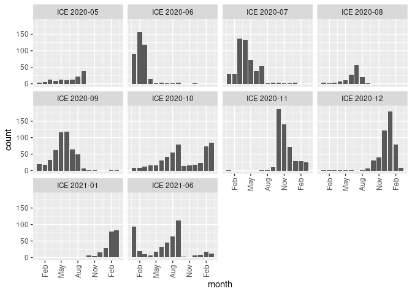<!-- -->

``` r
p2 <- data %>% ggplot(aes(x = month, fill=installment)) +
  geom_bar(width=10) +
  scale_x_date(labels = scales::date_format("%b"), 
               breaks = "3 month") +
  theme(axis.text.x = element_text(angle = 90,
                                   vjust = 0.5,
                                   hjust = 1))

p2
```

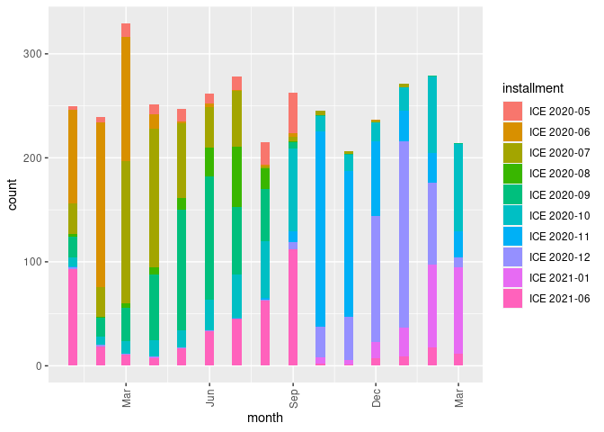<!-- -->

## Overview: Demographics

Here we display tables for basic demographic characteristics for
subjects of the ICE I-213 forms: ten most common “Country of
Citizenship” values; “Age” and “Sex” breakdowns (excluding missing
values); and “Complexion”.

“Complexion” values are decoded following [“The Border’s Long
Shadow”](https://www.aclumich.org/en/publications/borders-long-shadow)
(ACLU of Michigan, 2021).

``` r
i213 %>% count(country_of_citizenship, sort=TRUE) %>% 
  mutate(pct = n/sum(n) * 100) %>% 
  head(10)
```

    ## # A tibble: 10 x 3
    ##    country_of_citizenship     n    pct
    ##    <fct>                  <int>  <dbl>
    ##  1 MEXICO                  2445 62.9  
    ##  2 GUATEMALA                260  6.69 
    ##  3 INDIA                    245  6.30 
    ##  4 HONDURAS                 129  3.32 
    ##  5 EL SALVADOR               86  2.21 
    ##  6 CHINA                     86  2.21 
    ##  7 CANADA                    41  1.05 
    ##  8 SOUTH KOREA               41  1.05 
    ##  9 UKRAINE                   34  0.875
    ## 10 ROMANIA                   26  0.669

``` r
i213 %>%
    filter(!is.na(age), !is.na(sex)) %>%
    mutate(age_group = cut(age,
                           breaks = c(0, 18, 25, 40, 60, Inf),
                           right = FALSE)) %>%
    count(sex, age_group) %>%
    pivot_wider(names_from = sex, values_from = n)
```

    ## # A tibble: 5 x 4
    ##   age_group     M     F     U
    ##   <fct>     <int> <int> <int>
    ## 1 [0,18)       24    21    NA
    ## 2 [18,25)     374    75     1
    ## 3 [25,40)    1337   234     3
    ## 4 [40,60)     703   112     1
    ## 5 [60,Inf)     43    14    NA

``` r
good_values <- c("ALBINO",
                 "BLACK",
                 "DARK BROWN",
                 "DARK",
                 "FAIR",
                 "LIGHT BROWN",
                 "LIGHT",
                 "MEDIUM BROWN",
                 "MEDIUM",
                 "OLIVE",
                 "RUDDY",
                 "SALLOW",
                 "YELLOW")

i213 <- i213 %>% mutate(cmplxn = case_when(
         cmplxn %in% good_values ~ cmplxn,
         is.na(cmplxn) ~ NA_character_,
         TRUE ~ "OTHER"))

i213 %>% 
  count(cmplxn, sort = TRUE)
```

    ## # A tibble: 13 x 2
    ##    cmplxn           n
    ##    <chr>        <int>
    ##  1 MEDIUM        1680
    ##  2 <NA>          1038
    ##  3 MEDIUM BROWN   430
    ##  4 LIGHT BROWN    290
    ##  5 LIGHT          160
    ##  6 FAIR           158
    ##  7 DARK BROWN      37
    ##  8 DARK            35
    ##  9 BLACK           31
    ## 10 OLIVE           15
    ## 11 OTHER            9
    ## 12 RUDDY            2
    ## 13 SALLOW           2

## Apprehension location: “At/Near”

Most forms include an “At/Near” value indicating the location of the
apprehension; in some cases the “At/Near” field includes a reference to
“See Narrative”, in which case we extract this value from the
narrative field or complete by hand. In most cases these values follow a
“City, State” format; sometimes codes for specific points of entry
(e.g. “PHY” for the Pacific Highway POE in Blaine, WA; or “SEA” for
Seatle-Tacoma International Airport in Sea-Tac, WA) or names of specific
institutions such as jails or correctional facilities. We have
standardized values to “City, State” format and include latitude and
longitude values via Google Maps API.

“At/Near” values outside the Pacific Northwest may include subjects
apprehended elsewhere and processed by the Seattle ICE Field Office, but
I-213 narratives confirm that most apprehensions represented in the
dataset occurred in the Pacific Northwest.

``` r
i213 %>% count(at_near, sort = TRUE) %>% 
   filter(n >= 20)
```

    ## # A tibble: 41 x 2
    ##    at_near          n
    ##    <chr>        <int>
    ##  1 SEATAC, WA     418
    ##  2 PORTLAND, OR   359
    ##  3 BLAINE, WA     209
    ##  4 SUMAS, WA      169
    ##  5 SALEM, OR      134
    ##  6 EPHRATA, WA    110
    ##  7 EUGENE, OR      98
    ##  8 TACOMA, WA      98
    ##  9 LYNDEN, WA      96
    ## 10 SPOKANE, WA     95
    ## # … with 31 more rows

``` r
i213 %>%
   count(state, sort = TRUE)
```

    ## # A tibble: 11 x 2
    ##    state     n
    ##    <chr> <int>
    ##  1 WA     2594
    ##  2 OR      966
    ##  3 <NA>    235
    ##  4 ID       46
    ##  5 AK       14
    ##  6 CA       12
    ##  7 TX        7
    ##  8 PA        6
    ##  9 AZ        4
    ## 10 MT        2
    ## 11 NM        1

We can map records by their “At/Near” values in a variety of ways. For
more exaples, see:

  - Refer to other maps

<!-- end list -->

``` r
world <- ne_countries(scale = "medium", returnclass = "sf")
states <- st_as_sf(map("state", crs = 4326, plot = FALSE, fill = TRUE))
states <- cbind(states, st_coordinates(st_centroid(states)))
states$ID <- toTitleCase(as.character(states$ID))

sites <- i213 %>% select(lon, lat) %>% 
  na.omit()

sites <- st_as_sf(sites, coords = c("lon", "lat"),
                   crs = 4326, agr = "constant")

pnw_coords <- coord_sf(xlim = c(-130, -112.5), ylim = c(41, 50), expand = FALSE, crs = 4326)

data_at_near <- i213 %>% 
  group_by(at_near, lon, lat) %>% 
  summarise(n = n()) %>% 
  na.omit()

data_at_near <- st_as_sf(data_at_near, coords = c("lon", "lat"),
                  crs = 4326, agr = "constant")

ggplot(data = world) +
    geom_sf() +
    geom_sf(data = states, fill = NA) +
    geom_sf(data = data_at_near, aes(size=n), shape = 21, fill = "red", alpha=.5) +
    pnw_coords +
    ggtitle('I-213 forms by "at_near" latitude/longitude')
```

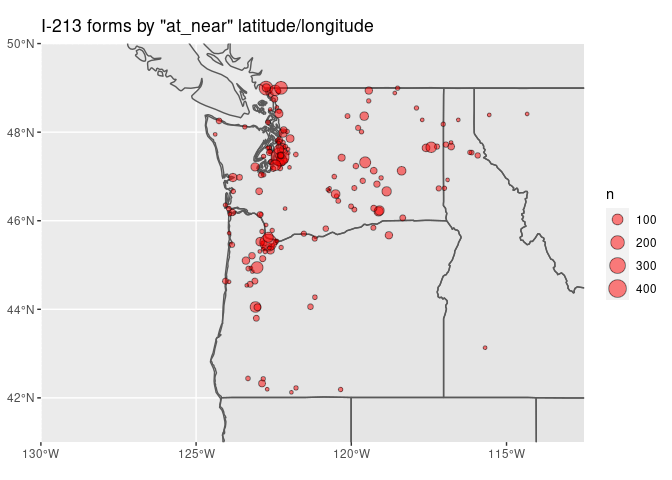<!-- -->

## Apprehension location by DHS office

I-213 forms include “Location Code” field designating the DHS office and
sub-office responsible for the apprehension. Values consist of two
three-letter codes separated by a forward-slash (“/”). No public data
dictionary translating these codes is known, but they appear to be
geographically consistent, as seen below. This analysis suggests that
the first part of the code designates the local ICE sub-field office or
Border Patrol station, while the second part of the code designates the
regional ICE field office or Border Patrol sector, e.g. “RIC/SEA” for
Seattle ICE Field Office, Richland, WA Sub-Field Office (largely
corresponding a published [map of ICE Enforcement and Removal Operations
field
offices](https://www.ice.gov/doclib/about/offices/ero/pdf/eroFieldOffices.pdf));
“EUG/POO” for Portland ICE Office, Eugene, OR Sub-Field Office;
“SMS/BLW” for Blaine Sector Border Patrol, Sumas Station; “SPK/SPW”
for Spokane Sector Border Patrol, Spokane Station (roughly corresponding
to a published [table of Border Patrol sectors and
stations](https://www.cbp.gov/border-security/along-us-borders/border-patrol-sectors)).

Plotting location codes (with added jitter for visual effect) and
simplified codes for DHS offices (with lines encircling points to
suggest jurisdictional demarcations) demonstrates the geographic
consistency of these values. Note that the Seattle ICE field office
covers the majority of the Seattle “Area of Responsibility” (WA, OR, AK;
Alaska records fall under the Anchorage Sub-Field Office, “ANC/ANC”);
note also the difference in coverage between the relatively localized
Blaine Sector Border Patrol (“BLW”) versus the wide geographic range of
the Spokane Sector (“SPW”). Note also the overlap of the Seattle,
Portland, and Spokane jurisdictions in Central Washington.

``` r
i213 %>% count(location_code, sort = TRUE) %>% 
   filter(n >= 20)
```

    ## # A tibble: 16 x 2
    ##    location_code     n
    ##    <chr>         <int>
    ##  1 SEA/SEA         907
    ##  2 <NA>            601
    ##  3 POO/POO         584
    ##  4 EUG/POO         271
    ##  5 SPK/SPW         263
    ##  6 SMS/BLW         204
    ##  7 BLS/BLW         174
    ##  8 RIC/SEA         167
    ##  9 YAK/SEA         122
    ## 10 WNT/SEA          94
    ## 11 ORV/SPW          91
    ## 12 BLH/BLW          66
    ## 13 MED/SEA          56
    ## 14 PHY/SEA          51
    ## 15 SPO/SEA          50
    ## 16 BLA/SEA          30

``` r
i213$office <- str_match(i213$location_code, "SEA|POO|BLW|SPW")

loc_codes <- i213 %>% 
  group_by(location_code) %>% 
  summarize(n = n()) %>% 
  arrange(desc(n)) %>% 
  na.omit()

top <- unlist(loc_codes[1:20, 'location_code'])

sites <- i213 %>% select(lon, lat, location_code, office) %>% 
  filter(location_code %in% top) %>%
  na.omit()

sites <- st_as_sf(sites, coords = c("lon", "lat"),
                   crs = 4326, agr = "constant")

sites <- cbind(sites, st_coordinates(sites))

# Exclude small number of records outside geographic bounds of Pacific Northwest
sites <- sites[sites$X < -110,]
sites <- sites[sites$X > -130,]
sites <- sites[sites$Y < 50,]
sites <- sites[sites$Y > 42,]

sites <- sites %>% 
  na.omit()

m1 <- ggplot() +
    geom_sf(data = world) +
    geom_sf(data = states, fill = NA) + 
    geom_jitter(data = sites, size = 2, shape = 23, width=.25, height=.25, aes(x = X, y = Y, fill = location_code)) +
    pnw_coords +
    ggtitle('I-213 forms by approx. "at_near" latitude/longitude')

m2 <- ggplot() +
    geom_sf(data = world) +
    geom_sf(data = states, fill = NA) + 
    geom_point(data = sites, size = 2, shape = 23, aes(x = X, y = Y, fill = office)) +
    geom_encircle(data = sites, aes(x = X, y = Y, group=office, col=office)) +
    pnw_coords +
    ggtitle('I-213 forms by "at_near" latitude/longitude')

m1
```

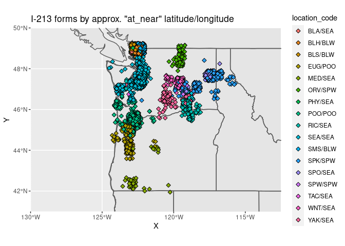<!-- -->

``` r
m2
```

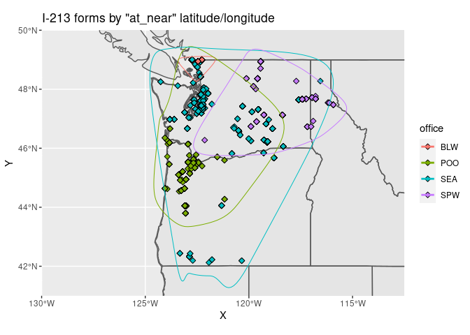<!-- -->

## “Method of Location/Apprehension”

The `method_location_apprehension` field consists of a set of regular
alphanumeric codes that apparently describe how the subject of the form
was identified or apprehended. No single source defining these codes is
known to be publicly available but several are mentioned in various
contexts and others can be tentatively decoded using context clues in
I-213 narratives. The ten most common codes follow:

``` r
i213 %>%
  filter(!is.na(method_location_apprehension)) %>% 
  count(method_location_apprehension, sort = TRUE) %>% 
   head(10)
```

    ## # A tibble: 10 x 2
    ##    method_location_apprehension     n
    ##    <chr>                        <int>
    ##  1 CLC NA                         523
    ##  2 PB UNKNOWN                     477
    ##  3 L NA                           460
    ##  4 NCA NA                         408
    ##  5 ISP NA                         351
    ##  6 CFD NA                         255
    ##  7 CST NA                         174
    ##  8 OA UNKNOWN                     140
    ##  9 CLC UNKNOWN                    105
    ## 10 I                               63

As seen above, most of the codes consist of a primary alphabetic code
followed by “NA” or “UNKNOWN”, but others include secodary alpha-numeric
codes. In some cases, the significance of these is unknown (e.g. “CLC
511.2.2”, “,”L 13D"). However, the primary codes can be standardized
into a dozen main categories, most of which can be tentatively decoded.

Several of the codes are described in an [ICE document obtained via FOIA
by the American Immigration
Council](https://www.americanimmigrationcouncil.org/sites/default/files/foia_documents/cap_ice_4-15-14_0.pdf)
(see page 44). Three of the codes refer to various jurisdictions of
ICE’s Criminal Alien Program (CAP): “CLC”, “CST” and “CFD”, referring
to CAP Local (city and county jails and correctional facilities), CAP
State (state prisons and corrections), and CAP Federal (federal prisons)
respectively. The same document defines “NCA” as “Non-Custodial Arrest”
for street arrests; and “L” as “Located” for arrests of fugitives.
Review of I-213 narratives is largely consistent with these
interpretations. (Other codes mentioned in this document are not
represented in the UWCHR I-213 collection.)

The code “OA” is defined as “Other Agency” in reports by the [ACLU of
Michigan](https://www.aclumich.org/en/publications/borders-long-shadow)
and the [American Immigration
Council](https://www.americanimmigrationcouncil.org/sites/default/files/foia_documents/seeking_information_about_border_patrol_practices_in_ohio_foia_cbp_forms.pdf),
and reportedly involves apprehensions carried out in support of or with
the support of other law enforcement agencies. Review of I-213
narratives is largely consistent with this interpretation; for example,
some arrests at courthouses in Central Washington involving
collaboration with local law enforcement are coded “OA”.

Other codes are tentatively deciphered as follows based on context clues
in I-213 narratives and other information:

  - “PB”: Likely “Patrolling Border”; appears to involve apprehensions
    of suspected unauthorized border-crossers at or near the physical
    border.
  - “ISP”: Likely “Inspection”; appears to involve apprehensions during
    inspection at authorized points of entry (mostly Sea-Tac Int’l
    Airport and border crossings in Blaine, WA).
  - “TCB”: Likely “Transportation/Bus Check”; almost all records involve
    immigration checks on board buses in the Spokane, WA area.
  - “OTF”: Likely “Task Force”; appears to involve apprehensions during
    joint task force operations with local law enforcement.
  - “LEA”: Likely “Law Enforcement Assistance”; appears to involve
    direct requests for assistance by local law enforcement.
  - “O”: Unknown, possibly “Other”.

We can examine these “Method of Location/Apprehension” categories along
various axes including over time, by “Location Code” as discussed above.
We note for example that the Seattle and Portland ICE offices have a
very different distribution of categories compared to the Blaine or
Spokane Border Patrol Sectors; and that the Blaine Border Patrol Sector
and Spokane Border Patrol Sector also differ, with Spokane’s
distribution more suggestive of reliance on collaboration with local law
enforcement.

Comparison of proportion of these categories by county is also
interesting: note high proportion of “PB” (“Patrolling Border”)
apprehensions in Northern border counties. Note also the correspondence
of the categories “CFD” (“CAP Federal”) and “CST” (“CAP State”) with
locations of major prisons: e.g. the Federal Detention Center, SeaTac in
King County; or Coyote Ridge Corrections Center in Connel, WA in
Franklin County.

``` r
i213 <- i213 %>% 
  mutate(method_short = case_when(
         str_detect(method_location_apprehension, "PB") ~ "PB",
         str_detect(method_location_apprehension, "CFD") ~ "CFD",
         str_detect(method_location_apprehension, "CST") ~ "CST",
         str_detect(method_location_apprehension, "CLC") ~ "CLC",
         str_detect(method_location_apprehension, "NCA") ~ "NCA",
         str_detect(method_location_apprehension, "LEA") ~ "LEA",
         str_detect(method_location_apprehension, "OA") ~ "OA",
         str_detect(method_location_apprehension, "OTF") ~ "OTF",
         str_detect(method_location_apprehension, "TCB") ~ "TCB",
         str_detect(method_location_apprehension, "ISP") ~ "ISP",
         str_detect(method_location_apprehension, "L") ~ "L",
         str_detect(method_location_apprehension, "O|0") ~ "O",
         is.na(method_location_apprehension) ~ NA_character_,
         TRUE ~ NA_character_),
         method_verbose = case_when(
         str_detect(method_location_apprehension, "PB") ~ "Patrolling",
         str_detect(method_location_apprehension, "CFD") ~ "CAP Federal",
         str_detect(method_location_apprehension, "CST") ~ "CAP State",
         str_detect(method_location_apprehension, "CLC") ~ "CAP Local",
         str_detect(method_location_apprehension, "NCA") ~ "Non-Custodial Arrest",
         str_detect(method_location_apprehension, "LEA") ~ "Law Enforcement Assist",
         str_detect(method_location_apprehension, "OA") ~ "Other Agency",
         str_detect(method_location_apprehension, "OTF") ~ "Other Task Force",
         str_detect(method_location_apprehension, "TCB") ~ "Transportation Check",
         str_detect(method_location_apprehension, "ISP") ~ "Inspection",
         str_detect(method_location_apprehension, "L") ~ "Located",
         str_detect(method_location_apprehension, "O|0") ~ "Other",
         is.na(method_location_apprehension) ~ NA_character_,
         TRUE ~ NA_character_))

i213$date <- as.Date(i213$date)

data <- i213 %>%
  select(date, state, source, method_location_apprehension, method_short, method_verbose, kww_in_force, office, county) %>%
  filter(!is.na(state),
         state == 'WA',
         date >= '2019-01-01',
         source == 'ice')

data$month <- as.Date(cut(data$date, breaks='month'))

p1 <- data %>% 
  ggplot(aes(x = month)) +
  geom_bar() +
  scale_x_date(labels = scales::date_format("%b"),
               breaks = "1 month") +
  facet_wrap(~method_short) +
  theme(axis.text.x = element_text(angle = 90,
                                   vjust = 0.5,
                                   hjust = 1))

p1
```

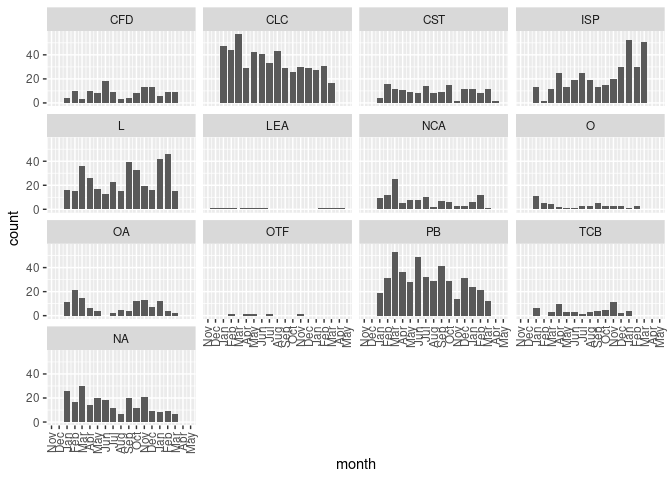<!-- -->

``` r
p2 <- data %>%
  ggplot(aes(x = method_short)) +
  geom_bar(aes(fill= method_short)) +
  facet_wrap(~office) +
  theme(axis.text.x = element_text(angle = 90,
                                   vjust = 0.5,
                                   hjust = 1))

p2
```

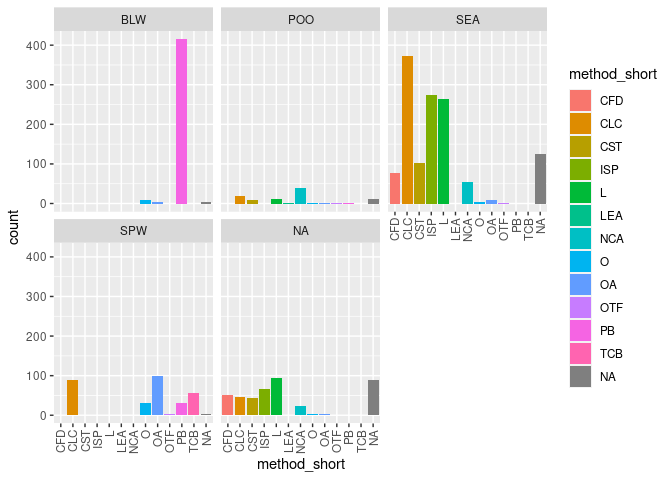<!-- -->

``` r
priority_counties <- read_yaml('../../shared/hand/priority_counties.yaml')
priority_counties <- append(priority_counties, 'Whatcom County')

p3 <- data %>% 
  filter(county %in% priority_counties) %>% 
  ggplot(aes(x = county, fill= method_verbose)) +
  geom_bar(position = "fill") +
  scale_y_continuous(labels = scales::percent) +
  theme(axis.text.x = element_text(angle = 90,
                                   vjust = 0.5,
                                   hjust = 1))

p3
```

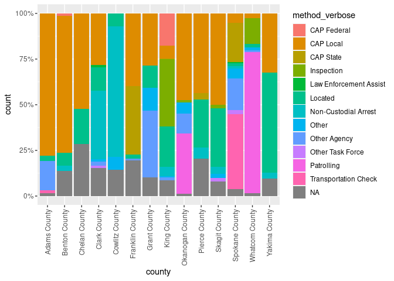<!-- -->

``` r
sites <- i213 %>% select(lon, lat, office, method_short) %>% 
  na.omit()

sites <- st_as_sf(sites, coords = c("lon", "lat"),
                   crs = 4326, agr = "constant")

sites <- cbind(sites, st_coordinates(sites))

st_crs(states) <- 4326
st_crs(states$geom) <- 4326
st_crs(sites) <- 4326
st_crs(sites$geometry) <- 4326

m1 <- ggplot() +
    geom_sf(data = world) +
    geom_sf(data = states, fill = NA) + 
    geom_jitter(data = sites, size = 2, shape = 23, width = .1, height = .1, aes(x = X, y = Y, fill = method_short)) +
    pnw_coords +
    facet_wrap(~method_short)
    ggtitle('I-213 forms by approx "at_near" latitude/longitude')
```

    ## $title
    ## [1] "I-213 forms by approx \"at_near\" latitude/longitude"
    ## 
    ## attr(,"class")
    ## [1] "labels"

``` r
m1
```

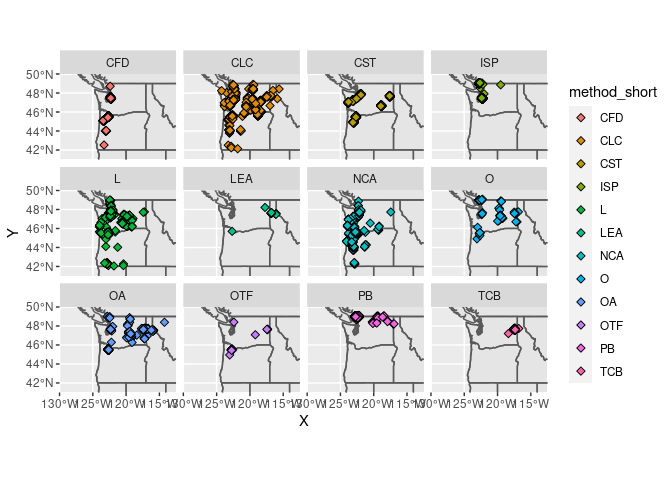<!-- -->

## Complexion by location and enforcement type

We can also examine various demographic characteristics in comparison
with the above categories; note below the only “Method of
Location/Apprehension” category with a majority of apprehensions
reported as being of people with “Fair” or “Light” complexion is “ISP”
or “Inspection” at authorized points of entry.

``` r
p1 <- i213 %>%
  ggplot(aes(x = cmplxn, fill= cmplxn)) +
  geom_bar() +
  facet_wrap(~office) +
  theme(axis.text.x = element_text(angle = 90,
                                   vjust = 0.5,
                                   hjust = 1))

p1
```

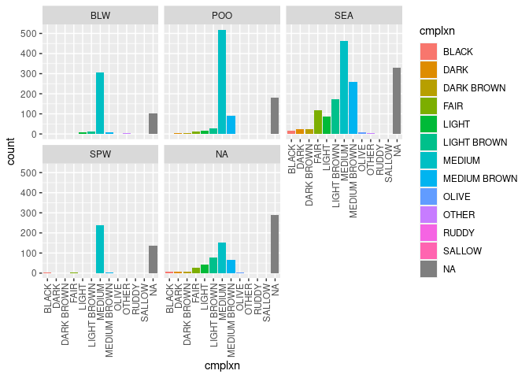<!-- -->

``` r
p2 <- i213 %>%
  ggplot(aes(x = cmplxn, fill= cmplxn)) +
  geom_bar() +
  facet_wrap(~method_short) +
  theme(axis.text.x = element_text(angle = 90,
                                   vjust = 0.5,
                                   hjust = 1))

p2
```

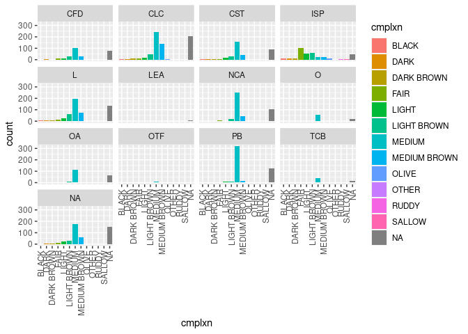<!-- -->
