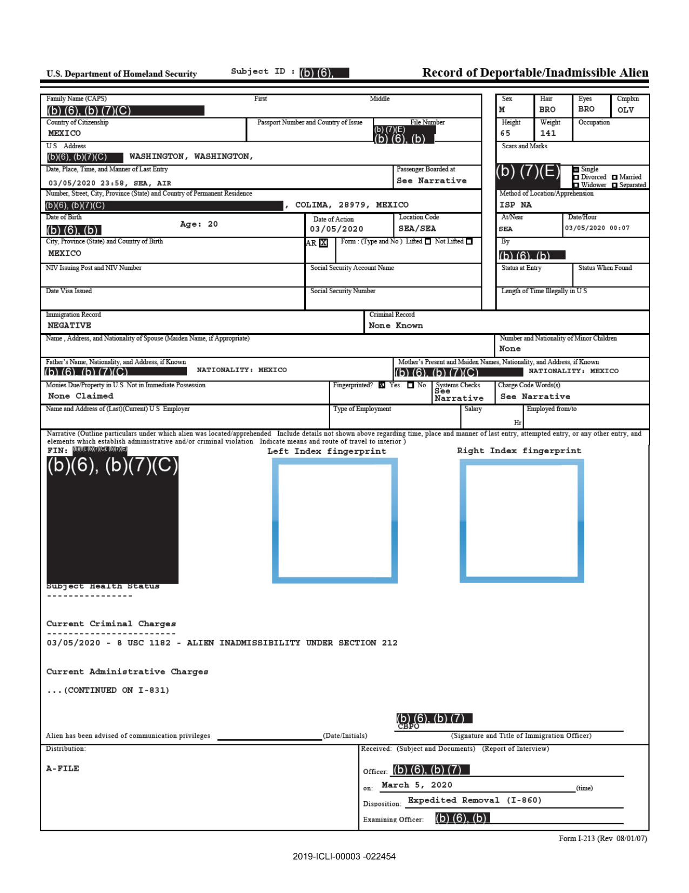
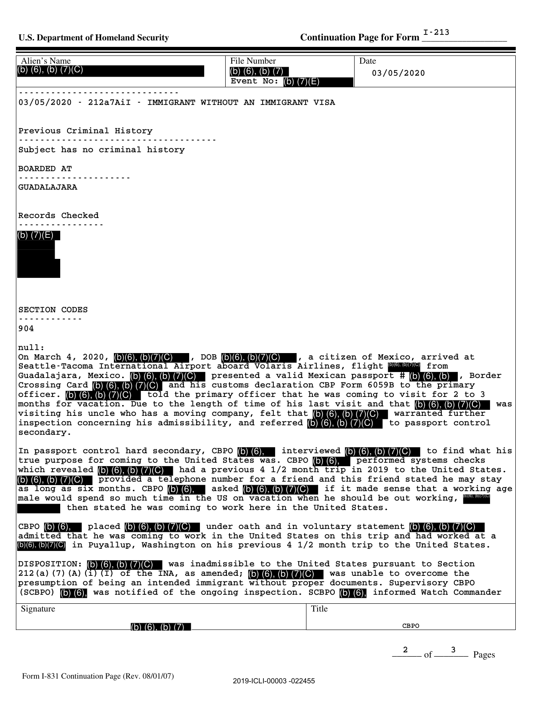

```{r import, message = FALSE, warning = FALSE}

pacman::p_load(tidyverse, lubridate, here, skimr, yaml, ggplot2, ggalt, gplots,
               sf, rnaturalearth, rnaturalearthdata, maps, tools, RColorBrewer
               )

inputfile <- here::here("write/input/uw-chr-i213-public.csv.gz")

i213 <- read_delim(
    inputfile, delim = "|", 
    col_types = cols(
        # .default                     = col_character(),
        source                       = col_character(),
        sex                          = col_character(),
        cmplxn                       = col_character(),
        country_of_citizenship       = col_factor(),
        year                         = col_double(),
        month                        = col_double(),
        day                          = col_double(),
        hour                         = col_double(),
        minute                       = col_double(),
        fy                           = col_double(),
        age                          = col_double(),
        accompanied_juvenile_flag    = col_double(),
        unaccompanied_juvenile_flag  = col_double(),
        custody_redetermination_flag = col_double()
))

```

```{r cleaning}

i213 <- i213 %>%
  mutate(across(where(is.character), ~ na_if(.,"")))

i213$date <- as.Date(i213$date)
i213$month <- as.Date(cut(i213$date, breaks='month'))

i213 <- i213 %>% 
  mutate(lawsuit = case_when(
           str_detect(installment, "2023") ~ 2,
            TRUE ~ 1))

good_values <- c("ALBINO",
                 "BLACK",
                 "DARK BROWN",
                 "DARK",
                 "FAIR",
                 "LIGHT BROWN",
                 "LIGHT",
                 "MEDIUM BROWN",
                 "MEDIUM",
                 "OLIVE",
                 "RUDDY",
                 "SALLOW",
                 "YELLOW")

i213 <- i213 %>% mutate(cmplxn = case_when(
         cmplxn %in% good_values ~ cmplxn,
         is.na(cmplxn) ~ NA_character_,
         TRUE ~ "OTHER"))

i213$office <- str_match(i213$location_code, "SEA|POO|BLW|SPW")

i213 <- i213 %>% 
  mutate(method_short = case_when(
           str_detect(method_location_apprehension, "PB") ~ "PB",
           str_detect(method_location_apprehension, "CFD") ~ "CFD",
           str_detect(method_location_apprehension, "CST") ~ "CST",
           str_detect(method_location_apprehension, "CLC") ~ "CLC",
           str_detect(method_location_apprehension, "NCA") ~ "NCA",
           str_detect(method_location_apprehension, "LEA") ~ "LEA",
           str_detect(method_location_apprehension, "OA") ~ "OA",
           str_detect(method_location_apprehension, "OTF") ~ "OTF",
           str_detect(method_location_apprehension, "TCB") ~ "TCB",
           str_detect(method_location_apprehension, "ISP") ~ "ISP",
           str_detect(method_location_apprehension, "REP") ~ "REP",
           str_detect(method_location_apprehension, "L") ~ "L",
           str_detect(method_location_apprehension, "O|0") ~ "O",
           is.na(method_location_apprehension) ~ NA_character_,
            TRUE ~ NA_character_),
         method_verbose = case_when(
           str_detect(method_location_apprehension, "PB") ~ "Patrol Border",
           str_detect(method_location_apprehension, "CFD") ~ "CAP Federal",
           str_detect(method_location_apprehension, "CST") ~ "CAP State",
           str_detect(method_location_apprehension, "CLC") ~ "CAP Local",
           str_detect(method_location_apprehension, "NCA") ~ "Non-Custodial Arrest",
           str_detect(method_location_apprehension, "LEA") ~ "Law Enforcement Assist",
           str_detect(method_location_apprehension, "OA") ~ "Other Agency",
           str_detect(method_location_apprehension, "OTF") ~ "Task Force",
           str_detect(method_location_apprehension, "TCB") ~ "Transportation Check",
           str_detect(method_location_apprehension, "ISP") ~ "Inspection",
           str_detect(method_location_apprehension, "REP") ~ "Reprocessed",
           str_detect(method_location_apprehension, "L") ~ "Located",
           str_detect(method_location_apprehension, "O|0") ~ "Other",
           is.na(method_location_apprehension) ~ NA_character_,
            TRUE ~ NA_character_),
         method_int_border = case_when(
           str_detect(method_location_apprehension, "PB") ~ "Border",
           str_detect(method_location_apprehension, "CFD") ~ "Interior",
           str_detect(method_location_apprehension, "CST") ~ "Interior",
           str_detect(method_location_apprehension, "CLC") ~ "Interior",
           str_detect(method_location_apprehension, "NCA") ~ "Interior",
           str_detect(method_location_apprehension, "LEA") ~ "Interior",
           str_detect(method_location_apprehension, "OA") ~ "Interior",
           str_detect(method_location_apprehension, "OTF") ~ "Interior",
           str_detect(method_location_apprehension, "TCB") ~ "Interior",
           str_detect(method_location_apprehension, "ISP") ~ "Border",
           str_detect(method_location_apprehension, "L") ~ "Interior",
           str_detect(method_location_apprehension, "REP") ~ "Other",
           str_detect(method_location_apprehension, "O|0") ~ "Other",
           is.na(method_location_apprehension) ~ NA_character_,
            TRUE ~ NA_character_))
```

# Descriptive analysis of UWCHR I-213 collection

As part of its ["Human Rights At Home"](https://jsis.washington.edu/humanrights/projects/human-rights-at-home/) and ["Immigrant Rights Observatory"](https://jsis.washington.edu/humanrights/projects/human-rights-at-home/immigrant-rights-observatory/) research initiatives, the University of Washington Center for Human Rights (UWCHR) has obtained a collection of I-213 "Record of Deportable/Inadmissible Alien" forms via Freedom of Information Act (FOIA) requests to the US Department of Homeland Security (DHS). These internal forms documenting apprehensions by US Immigration and Customs Enforcement (ICE) and Customs and Border Protection (CBP) are an important source of qualitative and quantitative information regarding immigration enforcement practices and patterns.

Under FOIA, UWCHR initially requested all I-213s produced by both CBP and ICE in the state of Washington from 2012-2017; when the agencies failed to adhere to the requirements of FOIA—first claiming privacy waivers were needed for every individual form and then claiming that as law enforcement agencies, they were exempt from providing such records—UWCHR sued in September 2018. UWCHR underwent separate settlement negotiations with each sub-agency. In these discussions, CBP agreed to provide a sample of all documents produced by staff in the agency’s Blaine and Spokane sectors from January 1, 2012 to September 30, 2017, totaling `r i213 %>% filter(source == "cbp") %>% nrow()` records; and ICE agreed to provide copies of all documents produced from January 1, 2019 to March 31, 2020 by staff from the agency’s Seattle field office, totaling `r i213 %>% filter(source == "ice", lawsuit == 1) %>% nrow()` records.

UWCHR later submitted an identical FOIA request to ICE for April 1, 2020, through November 30, 2021, and underwent a second lawsuit and settlement, resulting in the release of an additional `r i213 %>% filter(source == "ice", lawsuit == 2) %>% nrow()` records.

The resulting PDF forms were scraped and cleaned in a separate private repository developed by the Human Rights Data Analysis Group (HRDAG) and maintained by UWCHR. Cleaning and hand-coding of resulting data is ongoing; the following is a preliminary descriptive analysis of the collection. Maps of apprehension locations by I-213 `at_near` value and `at_near` county per capita were previously published for UWCHR's August 2021 report ["Protecting Immigrant Rights: Is Washington’s Law Working?"](https://jsis.washington.edu/humanrights/2021/08/11/protecting-immigrant-rights-is-washingtons-law-working/), see: [https://uwchr.github.io/i-213-analysis/map-wa.html](https://uwchr.github.io/i-213-analysis/map-wa.html).

## I-213 structure

Each record is made up of an I-213 "Record of Deportable/Inadmissible Alien" form collecting subject identification, biometrics, and apprehension characteristics data in a structured format (typographical variations may be introduced in the scraping process, we have attempted to standardize values in the cleaning process); followed by a semi-structured "Narrative" field containing additional description of the subject and apprehension, usually continued from the I-213 on one or more I-831 "Continuation Page" forms. Personally identifying information such as names and unique identifiers are redacted; narratives also include redactions under various FOIA exemptions. A small number of forms are fully redacted.

"Narrative" field contents are excluded from the public version of this dataset because they may contain sensitive information. Dataset fields following the naming convention `mentions_*` reflect simple `str_detect()` results for keywords in the "Narrative" text as described in the repository [README](https://github.com/UWCHR/i-213-analysis#readme).

While I-213 form contents are relatively structured, some fields may be left blank and the logic or meaning of codes used in some fields is obscure. For more details, see this ICE ["I-213 Preparation"](http://hoppocklawfirm.com/wp-content/uploads/2019/03/How-to-Prepare-an-I-213.pdf) document released via FOIA; note that in some cases field contents differ from those described here.

### Sample I-213 form

The following is a typical I-213 form representing an apprehension upon entry at Sea-Tac International Airport. Note redacted and blank I-213 fields, as well as fields filled with "See Narrative". Most but not all text fields are scraped for the dataset analyzed here. Tick boxes are not scraped. 



### Sample I-831 form

The following is a typical I-831 "Continuation Page" associated with the above I-213 form, which continues the "Narrative" field. Other text fields here are not scraped, but we note that the "Title" field might provide details regarding the official responsible for the apprehension, though this information is also included in the narrative in this case.

I-213 narratives follow a semi-regular structure; we have scraped `at_near` values from the narrative where the "At Near" field reads "See Narrative"; and we have attempted to scrape "Current Criminal Charges" and "Current Administrative Charges" as `charge_code_words`, with lots of OCR inconsistencies. It appears that I-213 narratives are at least in part machine-generated rather than entered by hand: note the "null:" pointer preceding the description of the apprehension below.



## Record source

UWCHR's I-213 collection consists of records produced by both CBP and ICE via FOIA litigation, as described above. CBP records are a sample (every 20th record) of all forms produced by staff in the agency’s Blaine and Spokane sectors from January 1, 2012 to September 30, 2017; ICE records include all documents produced from January 1, 2019 to November 30, 2021 by staff from the agency’s Seattle field office.

As seen below, some ICE records fall out of the window of time covered by the FOIA settlement; closer scrutiny of these records often shows that the I-213 "Date/Time" field (scraped as `year`, `month`, `day`, `hour`, `minute` fields; also converted into fiscal year `fy`) sometimes relates to a prior apprehension, with the `date_of_action` field more accurately reflecting the date of the apprehension described by the I-213 narrative. Missing "Date/Time" values have also been filled in with `date_of_action` values where appropriate. This cleaning is ongoing in a separate private repository; cleaning methods and data replacements available for review upon request. For most analysis below we will restrict the dataset to records dated January 1, 2019 and after.

A small number of records with missing `source` data represent fully-redacted forms produced by ICE; these are excluded in the following analysis. As CBP records are not intended to be comprehensive, and because CBP apprehensions which result in individuals being transferred to ICE custody are represented in the ICE I-213 collection, CBP records are also excluded from the following analysis.

```{r source, message = FALSE, warning = FALSE}

i213 <- i213 %>%
  mutate(across(where(is.character), ~ na_if(.,"")))


ann <- i213 %>%
    filter(!is.na(source)) %>% 
    count(source, year) %>%
    pivot_wider(names_from = source, values_from = n,
                values_fill = list(n = 0)) %>%
    arrange(year)
cbp <- i213 %>%
    filter(source == "cbp")

i213 <- i213 %>%
    filter(source != "cbp")
ann


```

## ICE record release installments

Records were released by ICE to UWCHR in installments. Following UWCHR's first FOIA lawsuit, nine initial monthly installments were released from May 2020 to January 2021. Subsequent UWCHR research revealed additional I-213 forms which should have been disclosed per the terms of the FOIA lawsuit settlement; in response, ICE released a final installment in June 2021. Records resulting from the second lawsuit were released in eight installments during 2023. Each ICE installment was released as a continuous PDF file. During the file scraping process, each installment was assigned a unique six-digit hash value for identification purposes.

Comparison of the installments follows. We note that date distribution of the installments is erratic but that the center of the date distributions of the first nine installments roughly advances chronologically through the timeline; while the final installment "back-fills" prior months. Note that the overall monthly distribution of records is relatively consistent until the onset of the COVID-19 pandemic in 2020. Comparison of the installments along other lines, such as geographic distribution, is possible but not particularly instructive; see "compare-installments.Rmd". Comparison of the records between lawsuit production periods is more useful; see "compare-lawsuits.Rmd".

```{r installment_distribution, message = FALSE, warning = FALSE}

i213$date <- as.Date(i213$date)

data <- i213 %>%
  select(date, source, installment, lawsuit) %>%
  filter(date >= '2019-01-01',
         # date <= '2020-03-31',
         source == 'ice')

data$month <- as.Date(cut(data$date, breaks='month'))

p1 <- data %>% ggplot(aes(x = month)) +
  geom_bar() +
  # scale_x_date(labels = scales::date_format("%b"), 
  #              breaks = "3 month") +
  facet_wrap(~installment) +
  theme(axis.text.x = element_text(angle = 90,
                                   vjust = 0.5,
                                   hjust = 1)) +
  labs(title = "I-213 installment distribution")

p1

p2 <- data %>% ggplot(aes(x = month, fill=installment)) +
  geom_bar(width=10) +
  #scale_x_date(labels = scales::date_format("%b"), 
  #             breaks = "3 month") +
  theme(axis.text.x = element_text(angle = 90,
                                   vjust = 0.5,
                                   hjust = 1))  +
  labs(title = "I-213 installment distribution")

p2

p3 <- data %>% ggplot(aes(x = month, fill=as.factor(lawsuit))) +
  geom_bar(width=10) +
  #scale_x_date(labels = scales::date_format("%b"), 
  #             breaks = "3 month") +
  theme(axis.text.x = element_text(angle = 90,
                                   vjust = 0.5,
                                   hjust = 1)) +
  labs(title = "I-213 distribution by lawsuit production")

p3

```

## Demographics: Overview

Here we display tables for basic demographic characteristics for subjects of the ICE I-213 forms: ten most common "Country of Citizenship" values; "Age" and "Sex" breakdowns (excluding missing values); and "Complexion".

"Complexion" values are decoded following ["The Border's Long Shadow"](https://www.aclumich.org/en/publications/borders-long-shadow) (ACLU of Michigan, 2021).

```{r demographics, message = FALSE, warning = FALSE}

i213 %>% count(country_of_citizenship, sort=TRUE) %>% 
  mutate(pct = n/sum(n) * 100) %>% 
  head(10)
  
i213 %>%
    filter(!is.na(age), !is.na(sex)) %>%
    mutate(age_group = cut(age,
                           breaks = c(0, 18, 25, 40, 60, Inf),
                           right = FALSE)) %>%
    count(sex, age_group) %>%
    pivot_wider(names_from = sex, values_from = n)


i213 %>% 
  count(cmplxn, sort = TRUE)

```

## Age/Sex

Distribution of age/sex over full ICE collection. Adult males make up vast majority of population:

```{r population_pyramid}

pop_data <- i213 %>%
    filter(!is.na(age), !is.na(sex), sex %in% c("M", "F")) %>%
    mutate(age_group = cut(age,
                           breaks = c(0, 18, 25, 40, 60, Inf),
                           right = FALSE),
           state = case_when(!state %in% c('WA', 'OR') ~ "ALL OTHERS",
                             TRUE ~ state)) %>%
    count(sex, age_group) %>%
    mutate(prop = n / sum(n)) %>%
    ungroup() %>% 
    mutate(n = case_when(sex == "F" ~ -n,
           TRUE ~ n),
           prop = case_when(sex == "F" ~ -prop,
           TRUE ~ prop))

pop_prop_range <- range(pop_data$prop)
pop_prop_range_breaks <- pretty(pop_prop_range, 10)

p1 <- pop_data %>% 
    ggplot(aes(x = prop, y = age_group, fill=sex)) +
    geom_col() +
    scale_y_discrete(limits=rev) +
    scale_x_continuous(breaks = pop_prop_range_breaks,
                       labels = function(x) scales::percent(abs(x))) +
  labs(title = "I-213 forms age/sex distribution")

p1

```

Distribution of age/sex by ICE lawsuit production. Note significantly greater proportion of females and juveniles in second lawsuit collection:

```{r pop_pyramid_lawsuit}

pop_data <- i213 %>%
    filter(!is.na(age), !is.na(sex), sex %in% c("M", "F")) %>%
    mutate(age_group = cut(age,
                           breaks = c(0, 18, 25, 40, 60, Inf),
                           right = FALSE)) %>%
    count(sex, age_group, lawsuit) %>%
    mutate(prop = n / sum(n)) %>%
    ungroup() %>% 
    mutate(n = case_when(sex == "F" ~ -n,
           TRUE ~ n),
           prop = case_when(sex == "F" ~ -prop,
           TRUE ~ prop))

pop_prop_range <- range(pop_data$prop)
pop_prop_range_breaks <- pretty(pop_prop_range, 10)

p1 <- pop_data %>% 
    ggplot(aes(x = prop, y = age_group, fill=sex)) +
    geom_col() +
    scale_y_discrete(limits=rev) +
    scale_x_continuous(breaks = pop_prop_range_breaks,
                       labels = function(x) scales::percent(abs(x))) + 
  facet_wrap(~lawsuit) +
  labs(title = "I-213 forms age/sex distribution",
       subtitle = "Subsets by lawsuit production")

p1

```

## Country ranking

Change in rank of most frequent `country_of_citizenship` values by quarter. Note reduction of Mexican nationality in latter portion of time period (second lawsuit production):

```{r country_rank}

my_theme <- function() {
  # Colors
  color.background = "white"
  color.text = "#22211d"
  # Begin construction of chart
  theme_bw(base_size=16) +
    # Format background colors
    theme(panel.background = element_rect(fill=color.background, color=color.background)) +
    theme(plot.background  = element_rect(fill=color.background, color=color.background)) +
    theme(panel.border     = element_rect(color=color.background)) +
    theme(strip.background = element_rect(fill=color.background, color=color.background)) +
    # Format the grid
    theme(panel.grid.major.y = element_blank()) +
    theme(panel.grid.minor.y = element_blank()) +
    theme(axis.ticks       = element_blank()) +
    # Format the legend
    theme(legend.position = "none") +
    # Format title and axis labels
    theme(plot.title       = element_text(color=color.text, size=20, face = "bold")) +
    theme(axis.title.x     = element_text(size=14, color="black", face = "bold")) +
    theme(axis.title.y     = element_text(size=14, color="black", face = "bold", vjust=1.25)) +
    theme(axis.text.x      = element_text(size=10, vjust=0.5, hjust=0, color = color.text)) +
    theme(axis.text.y      = element_text(size=10, color = color.text)) +
    theme(strip.text       = element_text(face = "bold")) +
    # Plot margins
    theme(plot.margin = unit(c(0.35, 0.2, 0.3, 0.35), "cm"))
}

show.top.n <- 10

rankings <- i213 %>% 
  filter(date >= '2019-01-01',
         date <= '2021-12-31') %>%
  mutate(country = substr(country_of_citizenship, start = 1, stop = 3)) %>% 
  count(quarter, country) %>% 
  arrange(quarter, desc(n), country) %>% 
  group_by(quarter) %>% 
  mutate(ranking = row_number(),
         quarter = as.character(quarter))

rankings <- rankings %>%
  mutate(flag = ifelse(country %in% c("MEX", "IND", "HON", "GUA", "NIC", "EL ", "VEN", "CHI"), TRUE, FALSE),
         country_col = if_else(flag == TRUE, country, "zzz"))

p1 <- rankings %>%
  ggplot(aes(x = quarter, y = ranking, group = country)) +
  geom_line(aes(color = country_col, alpha=1), linewidth = 2) +
  geom_point(aes(color = country_col, alpha=1), size = 4) +
  geom_point(color = "#FFFFFF", size = 1) +
  scale_y_reverse(breaks = 1:show.top.n) +
  geom_text(data = rankings %>% filter(quarter == '2019.2'),
            aes(label = country, x = 0) , hjust = 0, nudge_x=-.1, fontface = "bold", color = "#888888", size = 4) +
  geom_text(data = rankings %>% filter(quarter == '2022.1'),
            aes(label = country, x = 14) , hjust = 1.5, fontface = "bold", color = "#888888", size = 4) +
  coord_cartesian(ylim = c(show.top.n,1)) +
  theme(legend.position = "none") +
  labs(x = "Quarter",
       y = "Rank",
       title = "SEA AOR I-213s",
       subtitle = "Country of citizenship rank") +
  my_theme() +
  scale_color_manual(values = c("#F70020","#191A1A","#FB9701","#1A7D00","#072C8F", "yellow", 'purple', "lightblue", "grey"))

p1

```

## Apprehension location: "At/Near"

Most forms include an "At/Near" value indicating the location of the apprehension; in some cases the "At/Near" field includes a reference to "See Narrative", in which case we extract this value from the narrative field or complete by hand. In most cases these values follow a "City, State" format; sometimes codes for specific points of entry (e.g. "PHY" for the Pacific Highway POE in Blaine, WA; or "SEA" for Seatle-Tacoma International Airport in Sea-Tac, WA) or names of specific institutions such as jails or correctional facilities. We have standardized values to "City, State" format and include latitude and longitude values via Google Maps API.

Note that Seattle, WA and Portland, OR are sites of ICE field offices and may include forms processed in those offices but apprehended elsewhere; the same may be true of forms associated with the Northwest Detention Center in Tacoma, WA.

"At/Near" values outside the Pacific Northwest may include subjects apprehended elsewhere and processed by the Seattle ICE Field Office, but I-213 narratives confirm that most apprehensions represented in the dataset occurred in the Pacific Northwest.

```{r at_near, message = FALSE, warning = FALSE}

i213 %>% count(at_near, sort = TRUE) %>% 
   filter(n >= 20)

i213 %>%
   count(state, sort = TRUE)

rankings <- i213 %>% 
  filter(date >= '2019-01-01',
         date <= '2021-12-31') %>%
  count(quarter, at_near) %>% 
  arrange(quarter, desc(n), at_near) %>% 
  group_by(quarter) %>% 
  mutate(ranking = row_number(),
         quarter = as.character(quarter)) %>% 
  filter(ranking <= 5)

```

### Mapping apprehension location

We can map records by their "At/Near" values in a variety of ways. For more examples, see: [https://uwchr.github.io/i-213-analysis/map-wa.html](https://uwchr.github.io/i-213-analysis/map-wa.html)

```{r at_near_maps, message = FALSE, warning = FALSE}

world <- ne_countries(scale = "medium", returnclass = "sf")
states <- st_as_sf(map("state", crs = 4326, plot = FALSE, fill = TRUE))
states <- cbind(states, st_coordinates(st_point_on_surface(states)))
states$ID <- toTitleCase(as.character(states$ID))

pnw_coords <- coord_sf(xlim = c(-130, -112.5), ylim = c(41, 50), expand = FALSE, crs = 4326)

data_at_near <- i213 %>% 
  group_by(at_near, lon, lat, lawsuit) %>% 
  summarise(n = n()) %>% 
  na.omit()

data_at_near <- st_as_sf(data_at_near, coords = c("lon", "lat"),
                  crs = 4326, agr = "constant")

ggplot(data = world) +
    geom_sf() +
    geom_sf(data = states, fill = NA) +
    geom_sf(data = data_at_near, aes(size=n), shape = 21, fill = "red", alpha=.5) +
    pnw_coords +
    ggtitle('I-213 forms by "at_near" latitude/longitude')

```

### Apprehension location by DHS office

I-213 forms include "Location Code" field designating the DHS office and sub-office responsible for the apprehension. Values consist of two three-letter codes separated by a forward-slash ("/"). No public data dictionary translating these codes is known, but they appear to be geographically consistent, as seen below. This analysis suggests that the first part of the code designates the local ICE sub-field office or Border Patrol station, while the second part of the code designates the regional ICE field office or Border Patrol sector, e.g. "RIC/SEA" for Seattle ICE Field Office, Richland, WA Sub-Field Office (largely corresponding a published [map of ICE Enforcement and Removal Operations field offices](https://www.ice.gov/doclib/about/offices/ero/pdf/eroFieldOffices.pdf)); "EUG/POO" for Portland ICE Office, Eugene, OR Sub-Field Office; "SMS/BLW" for Blaine Sector Border Patrol, Sumas Station; "SPK/SPW" for Spokane Sector Border Patrol, Spokane Station (roughly corresponding to a published [table of Border Patrol sectors and stations](https://www.cbp.gov/border-security/along-us-borders/border-patrol-sectors)).

Plotting location codes (with added jitter for visual effect) and simplified codes for DHS offices (with lines encircling points to suggest jurisdictional demarcations) demonstrates the geographic consistency of these values. Some ICE field offices and Border Patrol sectors span multiple counties and states, while others are more localized. Note that the Seattle ICE field office covers the majority of the Seattle "Area of Responsibility" (WA, OR, AK; Alaska records fall under the Anchorage Sub-Field Office, "ANC/ANC"); note also the difference in coverage between the relatively localized Blaine Sector Border Patrol ("BLW") versus the wide geographic range of the Spokane Sector ("SPW"). Note also the overlap of the Seattle, Portland, and Spokane jurisdictions in Central Washington.

```{r loc_code, message = FALSE, warning = FALSE}

i213 %>% count(location_code, sort = TRUE) %>% 
   filter(n >= 20)

i213$office <- str_match(i213$location_code, "SEA|POO|BLW|SPW")

loc_codes <- i213 %>% 
  group_by(location_code) %>% 
  summarize(n = n()) %>% 
  arrange(desc(n)) %>% 
  na.omit()

loc_codes_county <- i213 %>% 
  group_by(location_code) %>% 
  summarize(n_counties = n_distinct(county),
            n_state = n_distinct(state)) %>% 
  arrange(desc(n_counties)) %>% 
  na.omit()

top <- unlist(loc_codes[1:20, 'location_code'])

sites <- i213 %>% select(lon, lat, location_code, office) %>% 
  filter(location_code %in% top) %>%
  na.omit()

sites <- st_as_sf(sites, coords = c("lon", "lat"),
                   crs = 4326, agr = "constant")

sites <- cbind(sites, st_coordinates(sites))

# Exclude small number of records outside geographic bounds of Pacific Northwest
sites <- sites[sites$X < -110,]
sites <- sites[sites$X > -130,]
sites <- sites[sites$Y < 50,]
sites <- sites[sites$Y > 42,]

sites <- sites %>% 
  na.omit()

m1 <- ggplot() +
    geom_sf(data = world) +
    geom_sf(data = states, fill = NA) + 
    geom_jitter(data = sites, size = 2, shape = 23, width=.25, height=.25, aes(x = X, y = Y, fill = location_code)) +
    pnw_coords +
    ggtitle('I-213 forms by approx. "at_near" latitude/longitude')

m2 <- ggplot() +
    geom_sf(data = world) +
    geom_sf(data = states, fill = NA) + 
    geom_point(data = sites, size = 2, shape = 23, aes(x = X, y = Y, fill = office)) +
    geom_encircle(data = sites, aes(x = X, y = Y, group=office, col=office)) +
    pnw_coords +
    ggtitle('I-213 forms by "at_near" latitude/longitude')

m1

m2

```

I-213 records from April 2020 through November 2021 (second lawsuit production) do not include any forms with location codes "BLW" or "SPW":

```{r lawsuit_office}

p1 <- i213 %>% 
  filter(source == 'ice') %>% 
  count(lawsuit, office) %>% 
  ggplot(aes(x = office, y=n, fill=as.factor(lawsuit))) +
  geom_col() +
  facet_wrap(~lawsuit) +
  labs(title = "I-213 form office code by lawsuit production")
  

p1

```


## "Method of Location/Apprehension"

The `method_location_apprehension` field consists of a set of regular alphanumeric codes that apparently describe how the subject of the form was identified or apprehended. No single source defining these codes is known to be publicly available but several are mentioned in various contexts and others can be tentatively decoded using context clues in I-213 narratives. The ten most common codes follow:

```{r method_location_apprehension_top_10, message = FALSE, warning = FALSE}

i213 %>%
  filter(!is.na(method_location_apprehension)) %>% 
  count(method_location_apprehension, sort = TRUE) %>% 
   head(10)

```

As seen above, most of the codes consist of a primary alphabetic code followed by "NA" or "UNKNOWN", but others include secodary alpha-numeric codes. In some cases, the significance of these is unknown (e.g. "CLC 511.2.2", "L 13D"). However, the primary codes can be standardized into a dozen main categories, most of which can be tentatively decoded.

Several of the codes are described in an [ICE document obtained via FOIA by the American Immigration Council](https://www.americanimmigrationcouncil.org/sites/default/files/foia_documents/cap_ice_4-15-14_0.pdf) (see page 44). Three of the codes refer to various jurisdictions of ICE's Criminal Alien Program (CAP): "CLC", "CST" and "CFD", referring to CAP Local (city and county jails and correctional facilities), CAP State (state prisons and corrections), and CAP Federal (federal prisons) respectively. The same document defines "NCA" as "Non-Custodial Arrest" for street arrests; and "L" as "Located" for arrests of fugitives. Review of I-213 narratives is largely consistent with these interpretations. (Other codes mentioned in this document are not represented in the UWCHR I-213 collection.)

The code "OA" is defined as "Other Agency" in reports by the [ACLU of Michigan](https://www.aclumich.org/en/publications/borders-long-shadow) and the [American Immigration Council](https://www.americanimmigrationcouncil.org/sites/default/files/foia_documents/seeking_information_about_border_patrol_practices_in_ohio_foia_cbp_forms.pdf), and reportedly involves apprehensions carried out in support of or with the support of other law enforcement agencies. Review of I-213 narratives is largely consistent with this interpretation; for example, some arrests at courthouses in Central Washington involving collaboration with local law enforcement are coded "OA".

Other codes are tentatively deciphered as follows based on context clues in I-213 narratives and other information:

- "PB": Likely "Patrolling Border"; appears to involve apprehensions of suspected unauthorized border-crossers at or near the physical border.
- "ISP": Likely "Inspection"; appears to involve apprehensions during inspection at authorized points of entry (mostly Sea-Tac Int'l Airport and border crossings in Blaine, WA).
- "TCB": Likely "Transportation/Bus Check"; almost all records involve immigration checks on board buses in the Spokane, WA area.
- "OTF": Likely "Task Force"; appears to involve apprehensions during joint task force operations with local law enforcement.
- "LEA": Likely "Law Enforcement Assistance"; appears to involve direct requests for assistance by local law enforcement.
- "O": Unknown, possibly "Other".

For a comparison of these codes with keywords mentioned in I-213 narratives, see: [https://uwchr.github.io/i-213-analysis/heatmaps.html](https://uwchr.github.io/i-213-analysis/heatmaps.html)

We can examine these "Method of Location/Apprehension" categories along various axes including over time, by "Location Code" as discussed above. We note for example that the Seattle and Portland ICE offices have a very different distribution of categories compared to the Blaine or Spokane Border Patrol Sectors; and that the Blaine Border Patrol Sector and Spokane Border Patrol Sector also differ, with Spokane's distribution more suggestive of reliance on collaboration with local law enforcement.

Comparison of proportion of these categories by county is also interesting: note high proportion of "PB" ("Patrolling Border") apprehensions in Northern border counties. Note also the correspondence of the categories "CFD" ("CAP Federal") and "CST" ("CAP State") with locations of major prisons: e.g. the Federal Detention Center, SeaTac in King County; or Coyote Ridge Corrections Center in Connel, WA in Franklin County.

```{r method_location_apprehension, message=FALSE, warning=FALSE}

i213$date <- as.Date(i213$date)

data <- i213 %>%
  select(date, state, source, method_location_apprehension, method_short, method_verbose, method_int_border, kww_in_force, office, county) %>%
  filter(!is.na(state),
         date >= '2019-01-01' & date <= '2022-01-01',
         source == 'ice')

data$month <- as.Date(cut(data$date, breaks='month'))

p1 <- data %>% 
  ggplot(aes(x = month)) +
  geom_bar() +
  # scale_x_date(labels = scales::date_format("%b"),
  #              breaks = "1 month") +
  facet_wrap(~method_short) +
  theme(axis.text.x = element_text(angle = 90,
                                   vjust = 0.5,
                                   hjust = 1)) +
  labs(title = "I-213 Method of location/apprehension dist.")

p1

# p2 <- data %>%
#   ggplot(aes(x = method_short)) +
#   geom_bar(aes(fill= method_short)) +
#   facet_wrap(~office) +
#   theme(axis.text.x = element_text(angle = 90,
#                                    vjust = 0.5,
#                                    hjust = 1))
# 
# p2

priority_counties <- read_yaml('../../shared/hand/priority_counties.yaml')
priority_counties <- append(priority_counties, 'Whatcom County')

p3 <- data %>% 
  filter(county %in% priority_counties) %>% 
  ggplot(aes(x = county, fill= method_verbose)) +
  geom_bar(position = "fill") +
  scale_y_continuous() +
  theme(axis.text.x = element_text(angle = 90,
                                   vjust = 0.5,
                                   hjust = 1))  +
  labs(title = "I-213 Method of location/apprehension prop.",
       subtitle = "WA priority counties")

p3

# p4 <- data %>% 
#   filter(!county %in% priority_counties) %>%
#   ggplot(aes(x = county, fill= method_verbose)) +
#   geom_bar(position = "fill") +
#   scale_y_continuous() +
#   theme(axis.text.x = element_text(angle = 90,
#                                    vjust = 0.5,
#                                    hjust = 1))
# 
# p4

# p5 <- data %>% 
#   filter(county %in% priority_counties) %>%
#   ggplot(aes(x = county, fill= method_int_border)) +
#   geom_bar() +
#   theme(axis.text.x = element_text(angle = 90,
#                                    vjust = 0.5,
#                                    hjust = 1)) +
#   labs(main= "I-213 Method of location/apprehension dist.")
# 
# p5

```

Note significant differences in categorization of I-213 forms by lawsuit production. It is an open question whether this is a result of changes in enforcement practices over time; or different criteria for record production via FOIA.

```{r method_lawsuit_compare}

p1 <- i213 %>% 
  filter(source == 'ice') %>% 
  count(lawsuit, method_short) %>% 
  ggplot(aes(x = method_short, y=n, fill=method_short)) +
  geom_col() +
  facet_wrap(~lawsuit)  +
  labs(title = "I-213 Method of location/apprehension dist.",
       subtitle = "Comparisin of lawusit productions")
  
p1

```

### OR

Focus on OR records:

```{r method_location_apprehension_or, message = FALSE, warning = FALSE}

data <- i213 %>%
  select(date, state, source, method_location_apprehension, method_short, method_verbose, kww_in_force, office, county) %>%
  filter(!is.na(state),
         date >= '2019-01-01',
         date <= '2021-12-31',
         source == 'ice')

data$month <- as.Date(cut(data$date, breaks='month'))

p1 <- data %>% 
  filter(!is.na(state),
         state == 'OR') %>% 
  ggplot(aes(x = month)) +
  geom_bar() +
  scale_x_date(labels = scales::date_format("%b"),
               breaks = "1 month") +
  facet_wrap(~method_short) +
  theme(axis.text.x = element_text(angle = 90,
                                   vjust = 0.5,
                                   hjust = 1)) +
  labs(title = "OR I-213 forms by method of location/apprehension")

p1

p3 <- data %>%
    filter(!is.na(state),
         state == 'OR') %>% 
  ggplot(aes(x = county, fill= method_verbose)) +
  geom_bar() +
  theme(axis.text.x = element_text(angle = 90,
                                   vjust = 0.5,
                                   hjust = 1)) +
  labs(title = "OR I-213 forms by county, method of location/apprehension")


p3

p5 <- data %>%
    filter(!is.na(state),
         state == 'OR') %>% 
  ggplot(aes(x = county, fill= method_verbose)) +
  geom_bar(position = "fill") +
  scale_y_continuous(labels = scales::percent) +
  theme(axis.text.x = element_text(angle = 90,
                                   vjust = 0.5,
                                   hjust = 1)) +
  labs(title = "OR I-213 forms by county, proportion method of location/apprehension")

p5

p4 <- data %>%
  filter(!is.na(state),
           state %in% c("OR", "WA")) %>% 
  ggplot(aes(x = state, fill= method_verbose)) +
  geom_bar() +
  theme(axis.text.x = element_text(angle = 90,
                                   vjust = 0.5,
                                   hjust = 1)) +
  labs(title = "OR I-213 forms by method of location/apprehension")


p4

p6 <- data %>%
    filter(!is.na(state),
           state %in% c("OR", "WA")) %>% 
  ggplot(aes(x = state, fill= method_verbose)) +
  geom_bar(position = "fill") +
  scale_y_continuous(labels = scales::percent) +
  theme(axis.text.x = element_text(angle = 90,
                                   vjust = 0.5,
                                   hjust = 1)) +
  labs(title = "I-213 forms by proportion method of location/apprehension",
       subtitle = "WA/OR comparison")

p6


p7 <- data %>%
    filter(!is.na(state),
         state == 'OR') %>% 
  group_by(month, method_verbose) %>% 
  summarize(n = n()) %>% 
  ggplot(aes(x = month, y=n, fill= method_verbose)) +
  geom_col() +
  theme(axis.text.x = element_text(angle = 90,
                                   vjust = 0.5,
                                   hjust = 1)) +
  facet_wrap(~method_verbose) +
  labs(title = "OR I-213 forms by method of location/apprehension")

p7

```

### Country of origin

A few views of most common "Country of Origin" categories.

```{r country_by_loc_meth, message=FALSE, warning=FALSE}

top <- c("MEXICO", "INDIA", "HONDURAS", "GUATEMALA", "NICARAGUA", "EL SALVADOR", "VENEZUELA", "CHINA")

i213 <- i213 %>% 
  filter(!is.na(country_of_citizenship)) %>% 
  mutate(country_short = case_when(country_of_citizenship %in% top ~ country_of_citizenship,
         TRUE ~ "ALL OTHERS"))

p1 <- i213 %>%
  ggplot(aes(x = country_short, fill= country_short)) +
  geom_bar() +
  facet_wrap(~office) +
  theme(axis.text.x = element_text(angle = 90,
                                   vjust = 0.5,
                                   hjust = 1))

p1

p2 <- i213 %>%
  ggplot(aes(x = method_short, fill= method_short)) +
  geom_bar() +
  facet_wrap(~country_short) +
  theme(axis.text.x = element_text(angle = 90,
                                   vjust = 0.5,
                                   hjust = 1))

p2

i213$month <- as.Date(cut(i213$date, breaks='month'))

p4 <- i213 %>% 
  filter(!is.na(state),
       state %in% c('WA','OR'),
       date >= '2019-01-01',
       source == 'ice') %>% 
  count(month, state, country_short) %>% 
  ggplot(aes(x = month, y = n, fill=country_short)) +
  geom_col() +
  facet_wrap(~state) +
  theme(axis.text.x = element_text(angle = 90,
                                   vjust = 0.5,
                                   hjust = 1))

p4

```

## Mapping "mentions_*"

A few passes at mapping records that mention keywords.

Note I-213s with narratives mentioning keyword "courthouse" include high concentration in central WA; see 2019 UWCHR [report on courthouse arrests in WA state](https://jsis.washington.edu/humanrights/2019/10/16/ice-cbp-courthouse-arrests/).

```{r mentions_courthouse_map, message=FALSE, warning=FALSE}

data <- i213 %>% 
  group_by(mentions_courthouse, lon, lat) %>% 
  summarise(n = n()) %>% 
  filter(mentions_courthouse == TRUE) %>% 
  na.omit()

data <- st_as_sf(data, coords = c("lon", "lat"),
                  crs = 4326, agr = "constant")

ggplot(data = world) +
    geom_sf() +
    geom_sf(data = states, fill = NA) +
    geom_sf(data = data, aes(size=n), shape = 21, fill = "red", alpha=.5) +
    pnw_coords +
    ggtitle('I-213 forms mentioning "courthouse" by "at_near" latitude/longitude')

```

```{r mentions_juvenile_map, message=FALSE, warning=FALSE}

data <- i213 %>% 
  group_by(mentions_juvenile, lon, lat) %>% 
  summarise(n = n()) %>% 
  filter(mentions_juvenile == TRUE) %>% 
  na.omit()

data <- st_as_sf(data, coords = c("lon", "lat"),
                  crs = 4326, agr = "constant")

ggplot(data = world) +
    geom_sf() +
    geom_sf(data = states, fill = NA) +
    geom_sf(data = data, aes(size=n), shape = 21, fill = "red", alpha=.5) +
    pnw_coords +
    ggtitle('I-213 forms mentioning "juvenile" by "at_near" latitude/longitude')

```

```{r mentions_bus_map, message=FALSE, warning=FALSE}

data <- i213 %>% 
  group_by(mentions_bus, lon, lat) %>% 
  summarise(n = n()) %>% 
  filter(mentions_bus == TRUE) %>% 
  na.omit()

data <- st_as_sf(data, coords = c("lon", "lat"),
                  crs = 4326, agr = "constant")

ggplot(data = world) +
    geom_sf() +
    geom_sf(data = states, fill = NA) +
    geom_sf(data = data, aes(size=n), shape = 21, fill = "red", alpha=.5) +
    pnw_coords +
    ggtitle('I-213 forms mentioning "bus" by "at_near" latitude/longitude')

```
